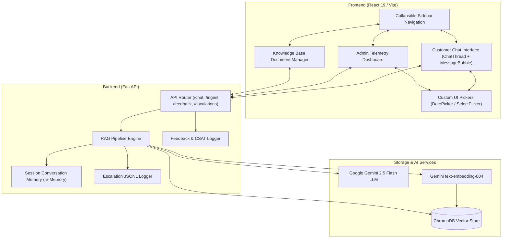
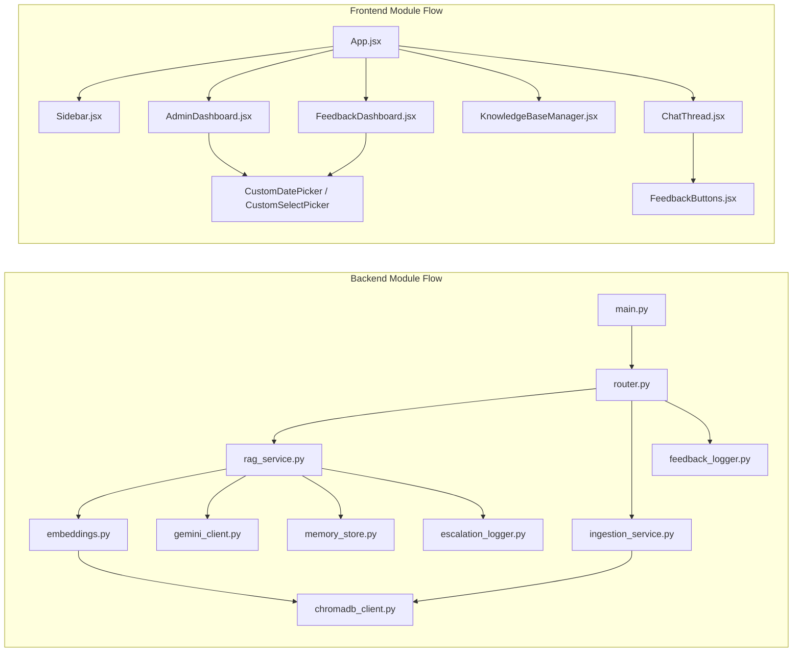

# Relay Support AI Platform

A production-grade, AI-augmented Customer Support Agent and Telemetry Platform powered by **FastAPI**, **Google Gemini 2.5 Flash**, **ChromaDB**, and **React + Vite**. Features grounded Retrieval-Augmented Generation (RAG), multi-turn conversation memory with session tracking, hybrid confidence & escalation scoring, real-time CSAT & user feedback analytics, interactive knowledge base management, a 5-card administrative telemetry dashboard, a collapsible sidebar navigation inspired by modern dashboard aesthetics, custom date/select pickers, and branded developer API documentation.

---

## Features

### Core Functionality
- **Grounded RAG Pipeline**: Answers customer support queries strictly using indexed company knowledge base documents, eliminating hallucinations.
- **Multi-Turn Conversation Memory**: Maintains session-aware context (capped to recent turns) to handle follow-up questions naturally.
- **Hybrid Confidence & Escalation Engine**: Dual-layer decision mechanism evaluating vector distance metrics and LLM uncertainty phrases (`"I don't have enough information..."`) to flag unanswerable or ambiguous queries for human review.
- **Automated Escalation Logging**: Persists low-confidence and escalated queries into a structured JSONL audit log with query metadata, distance scores, and answer previews.
- **User Feedback & CSAT Scoring**: Inline 👍 / 👎 rating controls under every agent message with optional comment popovers and live Customer Satisfaction (CSAT %) score calculations.

### Advanced Features
- **Knowledge Base Document Manager**: Complete CRUD suite to view, upload, search, filter, and delete knowledge base documents from ChromaDB with instant vector re-indexing.
- **Collapsible Sidebar Navigation**: Sleek, responsive sidebar with smooth collapse/expand transitions (`‹` / `›`), active tab highlights, new chat reset controls, and persistence via `localStorage`.
- **Custom UI Pickers**: Proprietary `CustomDatePicker` and `CustomSelectPicker` controls replacing browser-native inputs for consistent dark-themed UI styling across all filtering tools.
- **Admin Telemetry & Analytics Dashboard**: High-level administrative control center featuring a 5-column metric card grid (Total Queries, Escalation Rate %, Knowledge Docs, LLM Uncertainty, CSAT %), escalation log review modals, and real-time feedback inspection.
- **Rebranded Developer Swagger Docs**: Custom product-styled OpenAPI documentation (`http://localhost:8000/docs`) featuring custom CSS dark themes, custom brand logos, and structured endpoint groupings.

---

## Tech Stack

### Backend
- **FastAPI**: Asynchronous high-performance Python web framework.
- **Python 3.10+**: Core backend runtime environment.
- **Google Gemini API (`google-genai`)**: `gemini-2.5-flash` model for grounded answer generation and `text-embedding-004` for semantic vector embeddings.
- **ChromaDB**: In-memory and persistent vector database for similarity search.
- **Pydantic v2**: Strict data validation, schema enforcement, and settings management via `pydantic-settings`.
- **Pytest**: Comprehensive test suite with 58 automated test cases covering endpoints, memory stores, loggers, and RAG logic.

### Frontend
- **React 19**: Modern UI library with functional components and custom hooks.
- **Vite**: Ultra-fast frontend build tool and dev server.
- **Tailwind CSS**: Utility-first CSS framework customized with a rich dark color palette (`surface-800`, `brand-600`).
- **Lucide Icons**: Clean, scalable SVG icon set for navigation and telemetry indicators.

---

## System Architecture

The platform uses a decoupled architecture connecting a React single-page application with a FastAPI RAG service backed by ChromaDB and Google Gemini AI.



---

## Module Dependency



---

## Project Structure

```
AI Customer Support/
├── app/
│   ├── api/
│   │   ├── router.py               # REST API Endpoints (/health, /chat, /ingest, /escalations, /feedback, /documents)
│   │   └── schemas.py              # Pydantic DTO Schemas
│   ├── core/
│   │   ├── chromadb_client.py      # Persistent ChromaDB Singleton
│   │   ├── embeddings.py           # Gemini text-embedding-004 + fallback encoder
│   │   └── gemini_client.py        # Gemini LLM Client (google-genai SDK)
│   ├── services/
│   │   ├── ingestion_service.py    # Document chunking & vector indexing service
│   │   ├── rag_service.py          # Full RAG pipeline (Retrieval + Prompting + LLM)
│   │   ├── memory_store.py         # Thread-safe session conversation memory
│   │   ├── escalation_logger.py    # JSONL logger for unanswered / escalated queries
│   │   └── feedback_logger.py      # JSONL logger for CSAT ratings and comments
│   ├── utils/
│   │   └── text_splitter.py        # Recursive text chunking utility
│   ├── config.py                   # Pydantic BaseSettings environment loader
│   └── main.py                     # FastAPI App Entry Point with Swagger theme customization
├── data/
│   └── sample_faqs.json            # Default knowledge base FAQ documents
├── frontend/
│   ├── src/
│   │   ├── api/                    # API client wrappers (chatApi.js, adminApi.js, feedbackApi.js)
│   │   ├── components/
│   │   │   ├── Sidebar.jsx         # Collapsible sidebar navigation with custom SVG logo
│   │   │   ├── ChatThread.jsx      # Conversational UI message list
│   │   │   ├── MessageBubble.jsx   # Rich message rendering with confidence bars & sources
│   │   │   ├── FeedbackButtons.jsx # Inline 👍 / 👎 feedback buttons & comment popover
│   │   │   ├── AdminDashboard.jsx  # Telemetry dashboard & escalation viewer
│   │   │   ├── KnowledgeBaseManager.jsx # Document ingestion & removal manager
│   │   │   ├── FeedbackDashboard.jsx # CSAT analytics & feedback log viewer
│   │   │   ├── MetricCard.jsx      # Telemetry metric card component
│   │   │   ├── CustomDatePicker.jsx# Custom date picker component
│   │   │   └── CustomSelectPicker.jsx # Custom select dropdown component
│   │   ├── hooks/                  # Custom React hooks (useChat.js, useSession.js)
│   │   ├── App.jsx                 # Main application container & view router
│   │   └── index.css               # Design tokens, Tailwind CSS, & custom scrollbars
│   ├── package.json
│   └── vite.config.js
├── tests/
│   ├── conftest.py                 # Shared pytest fixtures (in-memory ChromaDB)
│   ├── test_api.py                 # Endpoint integration tests
│   ├── test_embeddings.py          # Embedding service unit tests
│   ├── test_escalation_logger.py   # Escalation logger unit tests
│   ├── test_feedback.py            # User feedback API & logger unit tests
│   ├── test_memory_store.py        # Session memory unit tests
│   ├── test_rag_service.py         # RAG pipeline unit tests
│   └── test_text_splitter.py       # Chunking utility unit tests
├── .env                            # Environment configuration
├── requirements.txt                # Python dependencies
└── README.md                       # Platform documentation
```

---

## API Documentation Overview

The backend exposes RESTful endpoints with interactive Swagger UI available at `http://localhost:8000/docs`.

- **Health Check**: `GET /health` — Check server status, ChromaDB connection, document count, and Gemini API configuration.
- **Chat & RAG**: `POST /chat` — Submit a question for grounded RAG answer generation with session tracking.
- **Clear Session**: `DELETE /chat/history/{session_id}` — Wipe conversation memory for a session.
- **Ingest Documents**: `POST /ingest` — Add custom knowledge base documents into ChromaDB.
- **List Documents**: `GET /documents` — Retrieve all indexed documents in the vector collection.
- **Delete Document**: `DELETE /documents/{doc_id}` — Remove a document from the vector collection.
- **Escalation Logs**: `GET /escalations` — Retrieve logged low-confidence or escalated customer queries.
- **Submit Feedback**: `POST /feedback` — Log user ratings (thumbs up/down) and optional feedback comments.
- **Feedback Summary**: `GET /feedback` — Fetch overall CSAT score, total positive/negative counts, and detailed feedback logs.

---

## Performance Benchmarks

### Vector Retrieval & RAG Latency
- **ChromaDB Vector Search**: < 15ms query execution time.
- **Context Generation & Prompt Construction**: < 2ms.
- **Gemini 2.5 Flash Response Time**: ~800ms - 1.2s end-to-end response delivery.
- **Session Memory Lookup**: < 1ms response time (in-memory thread-safe cache).

### Test Suite Execution
- **Total Test Cases**: 58 automated unit & integration tests.
- **Pass Rate**: 100% (58 / 58 passed).
- **Execution Time**: ~2.4 seconds across full suite.

---

## Quick Start

### 1. Prerequisites
- **Python 3.10+**
- **Node.js 18+** & `npm`
- **Google Gemini API Key**

### 2. Backend Setup
```bash
# Clone the repository
git clone https://github.com/Giancyril/AI-Customer-Support-Agent.git
cd AI-Customer-Support-Agent

# Create and activate virtual environment
python -m venv venv
# Windows:
venv\Scripts\activate
# Linux/macOS:
source venv/bin/activate

# Install dependencies
pip install -r requirements.txt
```

### 3. Environment Configuration
Create a `.env` file in the root directory:
```env
GEMINI_API_KEY=your_gemini_api_key_here
GEMINI_MODEL_NAME=gemini-2.5-flash
ENVIRONMENT=development
DEBUG=True
HOST=0.0.0.0
PORT=8000
RETRIEVAL_TOP_K=3
ESCALATION_DISTANCE_THRESHOLD=0.50
```

### 4. Run Backend & Frontend

**Terminal 1 — Backend Server:**
```bash
python -m uvicorn app.main:app --host 0.0.0.0 --port 8000 --reload
```
*API documentation will be live at `http://localhost:8000/docs`.*

**Terminal 2 — Frontend Dev Server:**
```bash
cd frontend
npm install
npm run dev
```
*Application interface will be live at `http://localhost:5173`.*

---

## Automated Verification

To run the complete automated test suite:
```bash
python -m pytest tests/ -v
```
