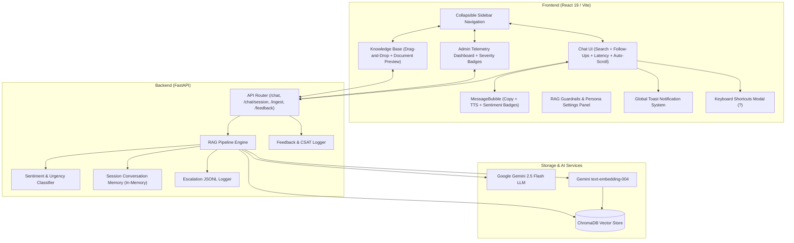

# Relay Support AI Platform

A production-grade, AI-augmented Customer Support Agent and Telemetry Platform powered by **FastAPI**, **Google Gemini 2.5 Flash**, **ChromaDB**, and **React + Vite**. Features grounded Retrieval-Augmented Generation (RAG), multi-turn conversation memory with session tracking, hybrid confidence & escalation scoring, **AI Sentiment & Urgency Classification**, real-time CSAT & user feedback analytics, **drag-and-drop Knowledge Base document ingestion**, **live chat message search with keyword highlighting**, **Global Toast Notification system**, **1-Click Copy & Chat Transcript Export (TXT/JSON)**, **Live Session Telemetry Stats bar**, **Contextual Follow-up Chips**, **Keyboard Shortcuts Cheat Sheet (`?`)**, **Auto-scroll lock detection**, **Inline Document Preview modal**, a 5-card administrative telemetry dashboard, a collapsible sidebar navigation with a custom vector SVG logo, Web Speech audio assistant capabilities (Voice Dictation & Text-to-Speech), AI prompt chips, live RAG guardrails tuning, one-click CSV/JSON audit exports, and branded developer API documentation.

---

## Features

### Core Functionality
- **Grounded RAG Pipeline**: Answers customer support queries strictly using indexed company knowledge base documents, eliminating hallucinations.
- **Multi-Turn Conversation Memory**: Maintains session-aware context (capped to recent turns) to handle follow-up questions naturally.
- **Hybrid Confidence & Escalation Engine**: Dual-layer decision mechanism evaluating vector distance metrics and LLM uncertainty phrases (`"I don't have enough information..."`) to flag unanswerable or ambiguous queries for human review.
- **Automated Escalation Logging**: Persists low-confidence and escalated queries into a structured JSONL audit log with query metadata, distance scores, and answer previews.
- **User Feedback & CSAT Scoring**: Inline 👍 / 👎 rating controls under every agent message with optional comment popovers and live Customer Satisfaction (CSAT %) score calculations.

### Advanced Features & 10+ Recent Suite Upgrades
- **🍞 Global Toast Notification System**: Zero-dependency `ToastContext` and `ToastContainer` with auto-dismiss stack, slide-in animations, and 4 severity types (success, error, warning, info).
- **📋 1-Click Copy-to-Clipboard**: Copy answer text instantly with visual `✓ Copied` state feedback and toast confirmation.
- **⚡ End-to-End Latency Tracking**: Computes exact query response execution time in milliseconds and displays an `⚡ 420ms` latency pill in agent response bubbles.
- **📊 Live Session Telemetry Stats Bar**: Header bar dynamically tracking turn counts, average latency, mean confidence percentage, and active escalation count.
- **💡 Contextual Follow-Up Suggestions**: Smart follow-up prompt chips (`💡 How long does a refund take? →`) dynamically calculated based on answer topic keywords.
- **📥 Chat Transcript Export (TXT & JSON)**: 1-click download of conversation history formatted as a clean `.txt` document or structured `.json` payload with source citations and confidence metrics.
- **⌨️ Keyboard Shortcuts Cheat Sheet**: Interactive hotkey modal triggered via **`?`** key or header button listing all application hotkeys (`Ctrl+F`, `Esc`, `Enter`, `Shift+Enter`).
- **⬇ Auto-Scroll Lock & Scroll-to-Latest Pill**: Pauses auto-scrolling when reading past messages and displays an animated floating `⬇ Scroll to latest` pill when scrolled up.
- **👁 Inline Document Preview Modal**: Popover in Knowledge Base Manager allowing full text inspection, chunk count breakdown, and source metadata viewing.
- **🏷️ AI Sentiment & Urgency Classifier**: Real-time **sentiment** and **urgency** badges powered by Gemini backend classifier:
  - **Sentiment** → 😡 Frustrated · 🚨 Urgent · 💬 Inquiring · 😐 Neutral
  - **Urgency** → 🔴 High Priority · 🟡 Medium Priority · 🟢 Low Priority
- **🔍 Live Chat Message Search Bar**: Collapsible search bar in the chat thread (**`Ctrl+F`**) with real-time keyword matching and ring highlighting.
- **📂 Drag-and-Drop Knowledge Base Uploader**: Interactive dropzone with animated hover states, multi-file validation, `.json` and `.txt` support, and pre-ingestion previews.
- **🚨 Computed Escalation Severity Levels**: Categorizes audit log records into `Critical Severity` (🔴), `Warning` (🟡), and `Informational` (🟢).
- **⏳ Multi-Stage Typing Indicator**: Animated thinking indicator cycling through operational stages (*"Searching vector index...", "Synthesizing with Gemini..."*).

---

## Tech Stack

### Backend
- **FastAPI**: Asynchronous high-performance Python web framework.
- **Python 3.10+**: Core backend runtime environment.
- **Google Gemini API (`google-genai`)**: `gemini-2.5-flash` model for grounded answer generation, sentiment classification, and `text-embedding-004` for semantic vector embeddings.
- **ChromaDB**: In-memory and persistent vector database for similarity search.
- **Pydantic v2**: Strict data validation, schema enforcement, and settings management via `pydantic-settings`.
- **Pytest**: Comprehensive test suite with **64 automated test cases** covering endpoints, session stats, sentiment classifier, memory stores, loggers, and RAG logic.

### Frontend
- **React 19**: Modern UI library with functional components, context providers, and custom hooks.
- **Vite**: Ultra-fast frontend build tool and dev server.
- **Tailwind CSS**: Utility-first CSS framework customized with a rich dark color palette (`surface-800`, `brand-600`).
- **Web Speech API**: Browser-native `SpeechRecognition` for voice input and `speechSynthesis` for text-to-speech playback.

---

## System Architecture



---

## Project Structure

```
AI Customer Support/
├── app/
│   ├── api/
│   │   ├── router.py               # REST API Endpoints (/health, /chat, /chat/session/{id}, /ingest, /escalations, /feedback)
│   │   └── schemas.py              # Pydantic DTO Schemas (includes SessionStatsResponse)
│   ├── core/
│   │   ├── chromadb_client.py      # Persistent ChromaDB Singleton
│   │   ├── embeddings.py           # Gemini text-embedding-004 + fallback encoder
│   │   └── gemini_client.py        # Gemini LLM Client (google-genai SDK)
│   ├── services/
│   │   ├── ingestion_service.py    # Document chunking & vector indexing service
│   │   ├── rag_service.py          # Full RAG pipeline + analyze_sentiment_and_urgency()
│   │   ├── memory_store.py         # Thread-safe session conversation memory
│   │   ├── escalation_logger.py    # JSONL logger for unanswered / escalated queries
│   │   └── feedback_logger.py      # JSONL logger for CSAT ratings and comments
│   ├── utils/
│   │   └── text_splitter.py        # Recursive text chunking utility
│   ├── config.py                   # Pydantic BaseSettings environment loader
│   └── main.py                     # FastAPI App Entry Point
├── data/
│   └── sample_faqs.json            # Default knowledge base FAQ documents
├── frontend/
│   ├── src/
│   │   ├── api/                    # API client wrappers (chatApi.js, adminApi.js, feedbackApi.js, kbApi.js)
│   │   ├── components/
│   │   │   ├── Sidebar.jsx         # Collapsible sidebar navigation with custom SVG logo
│   │   │   ├── ChatThread.jsx      # Search bar, auto-scroll lock, export actions (TXT/JSON)
│   │   │   ├── MessageBubble.jsx   # 1-Click Copy, Latency badge, Sentiment/Urgency pills, Follow-Up chips
│   │   │   ├── InputBar.jsx        # Pinned input bar with Speech Dictation & Prompt Chips
│   │   │   ├── ToastContainer.jsx  # Toast notification renderer
│   │   │   ├── SessionStats.jsx    # Header telemetry stats bar
│   │   │   ├── KeyboardShortcutsModal.jsx # Hotkeys cheat sheet modal (?)
│   │   │   ├── DocumentUploader.jsx# Drag-and-drop KB uploader
│   │   │   ├── DocumentList.jsx    # KB list with inline Document Preview modal
│   │   │   ├── EscalationTable.jsx # Escalation log with Severity levels & CSV/JSON export
│   │   │   ├── TypingIndicator.jsx # Multi-stage thinking animation
│   │   │   ├── RagSettingsPanel.jsx# Live RAG parameter tuning & persona panel
│   │   │   ├── FeedbackDashboard.jsx # CSAT analytics & feedback log viewer
│   │   │   ├── CustomDatePicker.jsx# Custom dark-themed date picker
│   │   │   └── CustomSelectPicker.jsx # Custom dark-themed select dropdown
│   │   ├── context/
│   │   │   └── ToastContext.jsx    # Global toast provider
│   │   ├── hooks/
│   │   │   ├── useToast.js         # Toast queue hook
│   │   │   ├── useChatExport.js    # TXT & JSON chat transcript export hook
│   │   │   ├── useChat.js          # Chat state, API calls & latency calculation
│   │   │   └── useSession.js       # Session ID management
│   │   ├── App.jsx                 # Main application container & view router
│   │   └── main.jsx                # React root wrapped with ToastProvider
│   ├── package.json
│   └── vite.config.js
├── tests/
│   ├── test_api.py                 # Endpoint integration tests (includes session stats endpoint)
│   ├── test_sentiment.py           # Sentiment & urgency classifier unit tests (5 cases)
│   └── ...                         # 64 total passing tests
├── .env                            # Environment configuration
├── requirements.txt                # Python dependencies
└── README.md                       # Platform documentation
```

---

## API Documentation Overview

| Method | Endpoint | Description |
|--------|----------|-------------|
| `GET` | `/health` | Check server status, ChromaDB connection, document count & Gemini API config |
| `POST` | `/chat` | Submit question for RAG answer; returns answer, confidence, sentiment, urgency, sources |
| `GET` | `/chat/session/{session_id}` | Retrieve active turn history and turn count metrics for a session |
| `DELETE` | `/chat/history/{session_id}` | Wipe conversation memory for a session |
| `POST` | `/ingest` | Add custom knowledge base documents into ChromaDB |
| `GET` | `/documents` | Retrieve all indexed documents in vector collection |
| `DELETE` | `/documents/{doc_id}` | Remove document from vector collection |
| `GET` | `/escalations` | Retrieve logged low-confidence or escalated queries |
| `POST` | `/feedback` | Log user ratings (thumbs up/down) and comments |
| `GET` | `/feedback` | Fetch CSAT score, rating counts, and feedback logs |

---

## Automated Verification

To run the complete automated test suite:
```bash
python -m pytest tests/ -v
```

Expected output: **64 passed** across all test modules in ~10 seconds.
