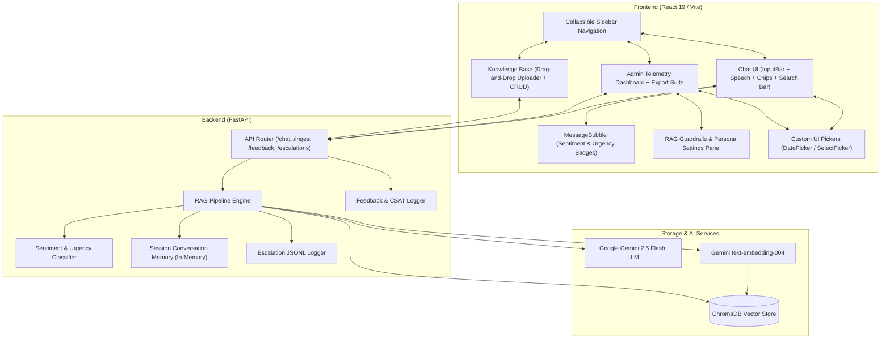
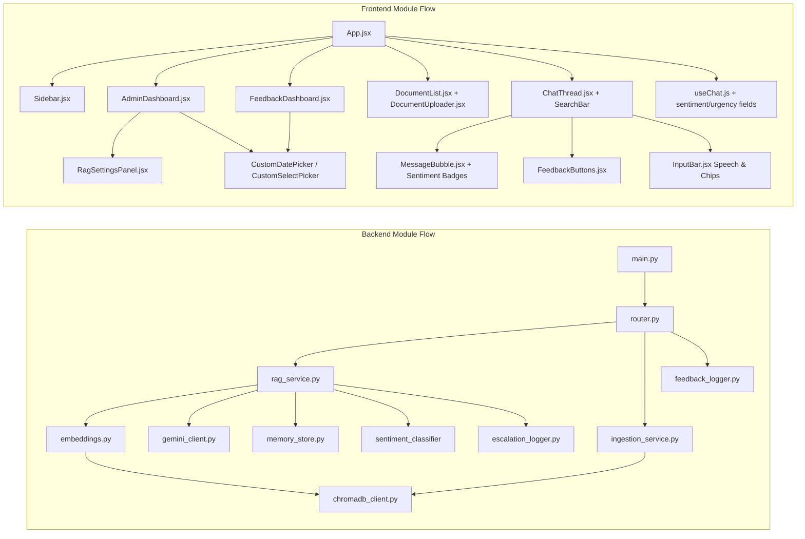

# Relay Support AI Platform

A production-grade, AI-augmented Customer Support Agent and Telemetry Platform powered by **FastAPI**, **Google Gemini 2.5 Flash**, **ChromaDB**, and **React + Vite**. Features grounded Retrieval-Augmented Generation (RAG), multi-turn conversation memory with session tracking, hybrid confidence & escalation scoring, **AI Sentiment & Urgency Classification**, real-time CSAT & user feedback analytics, **drag-and-drop Knowledge Base document ingestion**, **live chat message search with keyword highlighting**, interactive knowledge base management, a 5-card administrative telemetry dashboard, a collapsible sidebar navigation with a custom vector SVG logo, Web Speech audio assistant capabilities (Voice Dictation & Text-to-Speech), AI prompt chips, live RAG guardrails tuning, one-click CSV/JSON audit exports, and branded developer API documentation.

---

## Features

### Core Functionality
- **Grounded RAG Pipeline**: Answers customer support queries strictly using indexed company knowledge base documents, eliminating hallucinations.
- **Multi-Turn Conversation Memory**: Maintains session-aware context (capped to recent turns) to handle follow-up questions naturally.
- **Hybrid Confidence & Escalation Engine**: Dual-layer decision mechanism evaluating vector distance metrics and LLM uncertainty phrases (`"I don't have enough information..."`) to flag unanswerable or ambiguous queries for human review.
- **Automated Escalation Logging**: Persists low-confidence and escalated queries into a structured JSONL audit log with query metadata, distance scores, and answer previews.
- **User Feedback & CSAT Scoring**: Inline 👍 / 👎 rating controls under every agent message with optional comment popovers and live Customer Satisfaction (CSAT %) score calculations.

### Advanced Features
- ** AI Sentiment & Urgency Classifier**: Each agent response bubble now renders real-time **sentiment** and **urgency** badges powered by the Gemini-backed `analyze_sentiment_and_urgency()` backend classifier:
  - **Sentiment** → Frustrated (rose) ·  Urgent (amber) ·  Inquiring (sky) ·  Neutral (grey)
  - **Urgency** →  High Priority ·  Medium Priority ·  Low Priority
  - Delivered via `sentiment` and `urgency` fields on the `/chat` `ChatResponse` schema.
- ** Live Chat Message Search Bar**: Collapsible pinned search bar in the chat thread for real-time message filtering:
  - Toggle with **`Ctrl+F`** / **`⌘F`** keyboard shortcut or the floating button.
  - Matching messages are highlighted with a brand-colored ring; non-matching messages dim to 30% opacity.
  - Live match counter (`3 results`) displayed in the search bar.
  - Press **`Esc`** to close and clear the search.
- ** Drag-and-Drop Knowledge Base Uploader**: Full redesign of the KB document ingestion modal:
  - Animated drop zone with border highlight and scale effect on drag-over.
  - File **preview before committing** — shows document count, file size, and first 3 document titles.
  - Supports `.json` (FAQ arrays with `doc_id`, `title`, `content`) and `.txt` (auto-generates `doc_id`).
  - Remove/reset button to swap files without closing the modal.
  - Single-document form fallback preserved for manual entry.
- ** AI Suggested Prompt Chips**: Interactive recommendation pills (` 2FA`, ` Payment methods`, ` Web browsers`, ` Data security`) above the chat input for instant 1-click question submission.
- ** Web Speech Audio Assistant**:
  - **Voice Dictation**: Microphone input button in `InputBar.jsx` using Web Speech API (`SpeechRecognition`) for hands-free voice question dictation.
  - **Text-to-Speech Read Aloud**: Embedded read-aloud button on AI responses using Web Speech Synthesis (`speechSynthesis`) with voice playback controls.
- ** Live RAG Guardrails & Persona Settings Panel**: Interactive administrative control panel (`RagSettingsPanel.jsx`) allowing real-time tuning of RAG parameters:
  - Retrieval `Top-K` Chunks (1 to 5 chunks)
  - Escalation Distance Threshold (0.10 to 0.90)
  - AI Assistant Persona & Tone (*Professional*, *Concise*, *Empathetic*, *Technical*)
- ** One-Click Audit Export Suite**: Download filtered escalation log records in standard CSV or JSON format directly from the Admin Dashboard for compliance reporting.
- ** Knowledge Base Document Manager**: Complete CRUD suite to view, upload, search, filter, and delete knowledge base documents from ChromaDB with instant vector re-indexing.
- ** Collapsible Sidebar Navigation**: Sleek, responsive sidebar with smooth collapse/expand transitions (`‹` / `›`), a custom Relay AI vector SVG logo, active tab highlights, new chat reset controls, and persistence via `localStorage`.
- ** Custom UI Pickers**: Proprietary `CustomDatePicker` and `CustomSelectPicker` controls replacing browser-native inputs for consistent dark-themed UI styling across all filtering tools.
- ** Admin Telemetry & Analytics Dashboard**: High-level administrative control center featuring a 5-column metric card grid (Total Escalations, Avg Confidence, Vector Distance, LLM Uncertainty, CSAT %), escalation log review modals, and real-time feedback inspection.
- ** Rebranded Developer Swagger Docs**: Custom product-styled OpenAPI documentation (`http://localhost:8000/docs`) featuring custom CSS dark themes, custom brand logos, and structured endpoint groupings.

---

## Tech Stack

### Backend
- **FastAPI**: Asynchronous high-performance Python web framework.
- **Python 3.10+**: Core backend runtime environment.
- **Google Gemini API (`google-genai`)**: `gemini-2.5-flash` model for grounded answer generation, sentiment classification, and `text-embedding-004` for semantic vector embeddings.
- **ChromaDB**: In-memory and persistent vector database for similarity search.
- **Pydantic v2**: Strict data validation, schema enforcement, and settings management via `pydantic-settings`.
- **Pytest**: Comprehensive test suite with **63 automated test cases** covering endpoints, sentiment classifier, memory stores, loggers, and RAG logic.

### Frontend
- **React 19**: Modern UI library with functional components and custom hooks.
- **Vite**: Ultra-fast frontend build tool and dev server.
- **Tailwind CSS**: Utility-first CSS framework customized with a rich dark color palette (`surface-800`, `brand-600`).
- **Web Speech API**: Browser-native `SpeechRecognition` for voice input and `speechSynthesis` for text-to-speech playback.
- **Lucide Icons**: Clean, scalable SVG icon set for navigation and telemetry indicators.

---

## System Architecture

The platform uses a decoupled architecture connecting a React single-page application with a FastAPI RAG service backed by ChromaDB and Google Gemini AI.



---

## Module Dependency



---

## Project Structure

```
AI Customer Support/
├── app/
│   ├── api/
│   │   ├── router.py               # REST API Endpoints (/health, /chat, /ingest, /escalations, /feedback, /documents)
│   │   └── schemas.py              # Pydantic DTO Schemas (ChatResponse includes sentiment & urgency)
│   ├── core/
│   │   ├── chromadb_client.py      # Persistent ChromaDB Singleton
│   │   ├── embeddings.py           # Gemini text-embedding-004 + fallback encoder
│   │   └── gemini_client.py        # Gemini LLM Client (google-genai SDK)
│   ├── services/
│   │   ├── ingestion_service.py    # Document chunking & vector indexing service
│   │   ├── rag_service.py          # Full RAG pipeline + analyze_sentiment_and_urgency()
│   │   ├── memory_store.py         # Thread-safe session conversation memory
│   │   ├── escalation_logger.py    # JSONL logger for unanswered / escalated queries
│   │   └── feedback_logger.py      # JSONL logger for CSAT ratings and comments
│   ├── utils/
│   │   └── text_splitter.py        # Recursive text chunking utility
│   ├── config.py                   # Pydantic BaseSettings environment loader
│   └── main.py                     # FastAPI App Entry Point with Swagger theme customization
├── data/
│   └── sample_faqs.json            # Default knowledge base FAQ documents
├── frontend/
│   ├── src/
│   │   ├── api/                    # API client wrappers (chatApi.js, adminApi.js, feedbackApi.js, kbApi.js)
│   │   ├── components/
│   │   │   ├── Sidebar.jsx         # Collapsible sidebar navigation with custom SVG logo
│   │   │   ├── ChatThread.jsx      # Message list with pinned live search bar (Ctrl+F)
│   │   │   ├── MessageBubble.jsx   # Rich message rendering with sentiment/urgency badges, confidence bars, sources & TTS
│   │   │   ├── InputBar.jsx        # Pinned input bar with Speech Dictation & Prompt Chips
│   │   │   ├── DocumentUploader.jsx# Drag-and-drop KB uploader with file preview & validation
│   │   │   ├── DocumentList.jsx    # KB document list with search, filter & delete controls
│   │   │   ├── FeedbackButtons.jsx # Inline 👍 / 👎 feedback buttons & comment popover
│   │   │   ├── AdminDashboard.jsx  # Telemetry dashboard, escalation viewer & RAG settings
│   │   │   ├── RagSettingsPanel.jsx# Live RAG parameter tuning & persona config panel
│   │   │   ├── FeedbackDashboard.jsx # CSAT analytics & feedback log viewer
│   │   │   ├── MetricCard.jsx      # Telemetry metric card component
│   │   │   ├── EscalationTable.jsx # Escalation log table with CSV/JSON export
│   │   │   ├── ConfidenceBar.jsx   # Visual confidence score bar
│   │   │   ├── SourcesAccordion.jsx# Collapsible RAG source citations
│   │   │   ├── CustomDatePicker.jsx# Custom dark-themed date picker component
│   │   │   └── CustomSelectPicker.jsx # Custom dark-themed select dropdown component
│   │   ├── hooks/
│   │   │   ├── useChat.js          # Chat state, API calls & sentiment/urgency field wiring
│   │   │   └── useSession.js       # Session ID management & persistence
│   │   ├── App.jsx                 # Main application container & view router
│   │   └── index.css               # Design tokens, Tailwind CSS, & custom scrollbars
│   ├── package.json
│   └── vite.config.js
├── tests/
│   ├── conftest.py                 # Shared pytest fixtures (in-memory ChromaDB)
│   ├── test_api.py                 # Endpoint integration tests (includes sentiment/urgency schema)
│   ├── test_analytics.py           # Analytics endpoint tests
│   ├── test_embeddings.py          # Embedding service unit tests
│   ├── test_escalation_logger.py   # Escalation logger unit tests
│   ├── test_feedback.py            # User feedback API & logger unit tests
│   ├── test_kb_manager.py          # KB CRUD endpoint tests
│   ├── test_memory_store.py        # Session memory unit tests
│   ├── test_rag_service.py         # RAG pipeline unit tests
│   ├── test_sentiment.py           # Sentiment & urgency classifier unit tests (5 cases)
│   └── test_text_splitter.py       # Chunking utility unit tests
├── .env                            # Environment configuration
├── requirements.txt                # Python dependencies
└── README.md                       # Platform documentation
```

---

## API Documentation Overview

The backend exposes RESTful endpoints with interactive Swagger UI available at `http://localhost:8000/docs`.

| Method | Endpoint | Description |
|--------|----------|-------------|
| `GET` | `/health` | Check server status, ChromaDB connection, document count & Gemini API config |
| `POST` | `/chat` | Submit a question for grounded RAG answer with session tracking; returns `answer`, `escalated`, `confidence_score`, `sentiment`, `urgency`, `sources` |
| `DELETE` | `/chat/history/{session_id}` | Wipe conversation memory for a session |
| `POST` | `/ingest` | Add custom knowledge base documents into ChromaDB |
| `GET` | `/documents` | Retrieve all indexed documents in the vector collection |
| `DELETE` | `/documents/{doc_id}` | Remove a document from the vector collection |
| `GET` | `/escalations` | Retrieve logged low-confidence or escalated customer queries |
| `POST` | `/feedback` | Log user ratings (thumbs up/down) and optional feedback comments |
| `GET` | `/feedback` | Fetch overall CSAT score, total positive/negative counts, and detailed feedback logs |

---

## Performance Benchmarks

### Vector Retrieval & RAG Latency
- **ChromaDB Vector Search**: < 15ms query execution time.
- **Context Generation & Prompt Construction**: < 2ms.
- **Gemini 2.5 Flash Response Time**: ~800ms – 1.2s end-to-end response delivery.
- **Sentiment & Urgency Classification**: < 5ms (keyword-based, no additional LLM call).
- **Session Memory Lookup**: < 1ms response time (in-memory thread-safe cache).

### Test Suite Execution
- **Total Test Cases**: 63 automated unit & integration tests.
- **Pass Rate**: 100% (63 / 63 passed).
- **Execution Time**: ~7.4 seconds across full suite.

